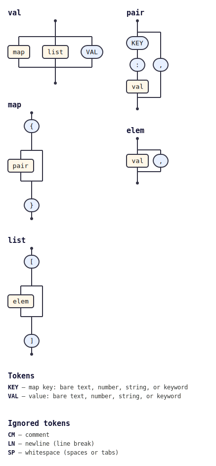

# json

A standard JSON parser for TypeScript/JavaScript and Go, built as a
grammar plugin for the [`tabnas`](https://github.com/tabnas/parser)
parsing engine.

```
{"a":1,"b":[2,3]}  →  { a: 1, b: [2, 3] }
```

This package implements exactly the JSON grammar defined by
[RFC 8259](https://www.rfc-editor.org/rfc/rfc8259) / ECMA-404 and nothing
more: objects, arrays, strings, numbers, and the literals `true`, `false`
and `null`. It rejects everything an extended grammar would relax —
comments, trailing commas, unquoted keys, single-quoted and multiline
strings, implicit objects and arrays, hex/octal numbers, leading zeros.
If `JSON.parse` (TS/JS) or `encoding/json` (Go) would reject the input,
so does this parser.

## How it works

The [`tabnas`](https://github.com/tabnas/parser) engine ships **no
grammar**; every grammar is a plugin. This package supplies the
standard-JSON grammar plugin for both runtimes. The rule set
(`val` / `map` / `list` / `pair` / `elem`) is the **"Plain JSON"** grammar
from [`jsonic`](https://github.com/tabnas/jsonic) — the pure-JSON core
jsonic defines before extending it for the relaxed jsonic format. Here
that core is installed on its own, with the lexer restricted to strict
JSON.

> This repository began from the
> [`tabnas/jsonic`](https://github.com/tabnas/jsonic) template and was
> refactored down to a standard JSON parser: it keeps jsonic's Plain JSON
> grammar and drops the extended grammar, in both TS and Go.

Because it is a plain grammar plugin on the shared engine, it is intended
to be the **foundation other tabnas parsers build on**: `use` it first,
then layer additional rules on the shared `val` / `map` / `list` /
`pair` / `elem` rules.

## Choose your runtime

| Runtime | Start here |
|---|---|
| **TypeScript / JavaScript** (`@tabnas/json`) | [`ts/README.md`](ts/README.md) |
| **Go** (`github.com/tabnas/json/go`) | [`go/README.md`](go/README.md) |

Both runtimes are grammar plugins on the `tabnas` engine — the TypeScript
package on the `@tabnas/parser` npm package, the Go module on
`github.com/tabnas/parser/go`. TypeScript is canonical: both suites run
the shared conformance fixtures in [`ts/test/spec/`](ts/test/spec/).

## Documentation

Full [Diátaxis](https://diataxis.fr) documentation, four quadrants per
runtime:

| | TypeScript / JavaScript | Go |
|---|---|---|
| **Tutorial** (learn) | [`ts/doc/tutorial.md`](ts/doc/tutorial.md) | [`go/doc/tutorial.md`](go/doc/tutorial.md) |
| **How-to** (recipes) | [`ts/doc/guide.md`](ts/doc/guide.md) | [`go/doc/guide.md`](go/doc/guide.md) |
| **Reference** (API/CLI) | [`ts/doc/reference.md`](ts/doc/reference.md) | [`go/doc/reference.md`](go/doc/reference.md) |
| **Concepts** (why) | [`ts/doc/concepts.md`](ts/doc/concepts.md) | [`go/doc/concepts.md`](go/doc/concepts.md) |

## Quick example

TypeScript / JavaScript:

```ts
import { parse, json } from '@tabnas/json'

parse('{"a":1,"b":[2,3]}') // { a: 1, b: [2, 3] }

// or install the plugin on your own engine instance:
import { Tabnas } from '@tabnas/parser'
const tn = new Tabnas({ plugins: [json] })
tn.parse('[1,2,3]')
```

Go:

```go
import (
	tabnasjson "github.com/tabnas/json/go"
	tabnas "github.com/tabnas/parser/go"
)

v, err := tabnasjson.Parse(`{"a":1,"b":[2,3]}`)

// or install the plugin on your own engine instance:
j := tabnas.Make()
j.Use(tabnasjson.Json)
v, err = j.Parse(`[1,2,3]`)
```

## Building locally

This package depends on the `tabnas` engine as a sibling checkout (the
same model jsonic uses), until `tabnas/parser` publishes tagged packages:

```bash
git clone https://github.com/tabnas/parser     # sibling of this repo
git clone https://github.com/tabnas/json
```

Then build the engine first and run each runtime's tests — see
[`AGENTS.md`](AGENTS.md) and the per-runtime READMEs. CI does this
automatically (`.github/workflows/build.yml`).

## Grammar diagram

The grammar as a railroad/syntax diagram, generated from the live grammar
with [`@tabnas/railroad`](https://github.com/tabnas/railroad):



ASCII version: [`ts/doc/grammar.txt`](ts/doc/grammar.txt).

## License

MIT.
